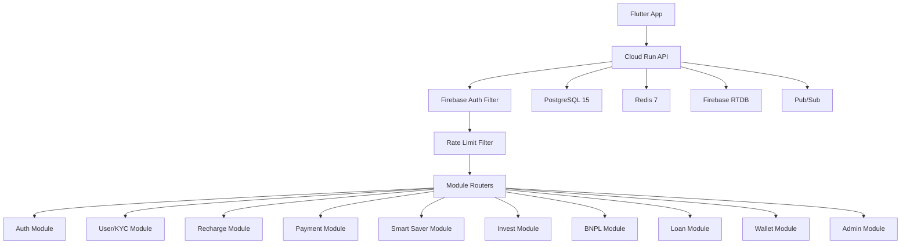

# YouPI V2 Backend — Implementation Walkthrough

## Overview

Fully implemented a **Kotlin Spring Boot 3.2 modular monolith** backend for the YouPI V2 super-app. The system covers **10 feature modules**, **4 shared libraries**, **8 DB migrations**, and **GCP production infrastructure**.

## Architecture

## Completed Tasks

### TASK-00 to TASK-03: Foundation
- Multi-module Gradle project with 14 subprojects
- Flyway migrations V1–V8 covering entire domain model
- Firebase Auth filter, MPIN JWT (RS256), OTP service, AES-256-GCM encryption
- Auth module with full login/register/MPIN flow

### TASK-04: User & KYC Module
| File | Purpose |
|------|---------|
| `UserDomain.kt` | DTOs, KYC state machine enum, sealed exceptions |
| `UserRepositories.kt` | R2DBC entities for `kyc_records`, `smart_saver_documents` |
| `UserService.kt` | Profile CRUD, KYC orchestration (Aadhaar→PAN→Selfie→Verified) |
| `UserRouter.kt` | 7 endpoints under `/api/v1/user` |

### TASK-05: Recharge Module
| File | Purpose |
|------|---------|
| `RechargeDomain.kt` | DTOs, `PaymentMode` enum (FULL, EMI_3/6/12, SMART_SAVER) |
| `RechargeRepositories.kt` | R2DBC entities for orders + EMI schedules |
| `RechargeService.kt` | Plan fetch (Redis cached 30m), order creation, EMI generation |
| `RechargeRouter.kt` | 4 endpoints: plans, order, status, history |

### TASK-06: Payment Module
| File | Purpose |
|------|---------|
| `PaymentDomain.kt` | DTOs, `PaymentPurpose` enum, sealed exceptions |
| `PaymentRepositories.kt` | R2DBC entity for `payment_orders` |
| `PaymentService.kt` | Razorpay order creation, **HMAC-SHA256 signature verification**, idempotent webhooks |
| `PaymentRouter.kt` | 3 endpoints + unauthenticated `/webhooks/razorpay` |

### TASK-07: Smart Saver Module
| File | Purpose |
|------|---------|
| `SmartSaverService.kt` | Deposit management, **atomic credit deduction** (80% collateral limit), admin activation |
| `SmartSaverRouter.kt` | 2 endpoints: balance, deposit |

### TASK-08: Invest Module
| File | Purpose |
|------|---------|
| `InvestService.kt` | Gold price caching (**35s TTL**), gold buy with idempotency, holdings, FD list |
| `InvestRouter.kt` | 4 endpoints: gold price, holdings, buy, FD list |

### TASK-09: BNPL Module
| File | Purpose |
|------|---------|
| `BnplService.kt` | 3-step application with **Redis session** (30m TTL), auto-decision via CIBIL score, limit calculation |
| `BnplRouter.kt` | 4 endpoints: status, step1/2/3 |

### TASK-10: Loan Module
| File | Purpose |
|------|---------|
| `LoanService.kt` | 3-step application, **EMI calculator** (reducing balance formula), Redis session, eNACH |
| `LoanRouter.kt` | 6 endpoints: status, step1/2/3, schedule, calculator |

### TASK-11: Wallet Module
| File | Purpose |
|------|---------|
| `WalletService.kt` | **Atomic credit/debit** via PostgreSQL `RETURNING` clause, double-entry ledger, P2P transfer |
| `WalletRouter.kt` | 3 endpoints: balance, ledger, transfer |

### TASK-12: Admin Module
| File | Purpose |
|------|---------|
| `AdminService.kt` | Dashboard, user list/details, role management, active toggle |
| `AdminRouter.kt` | 5 endpoints under `/api/v1/admin` (requires ADMIN role) |

### TASK-13-15: Infrastructure & Cross-Cutting
| File | Purpose |
|------|---------|
| `cloud-run.yml` | Cloud Run service config (gen2, scaling 1-10, health probes, secrets) |
| `main.tf` | Terraform: Cloud SQL, Memorystore Redis, Pub/Sub topics, VPC |
| `firebase-rules.json` | RTDB security rules (user-scoped reads, server-only writes) |
| `FirebaseRealtimeService.kt` | Push updates: recharge, gold, BNPL, loan status |
| `PubSubPublisher.kt` | Lazy publisher, JSON serialization, graceful shutdown |
| `RequestIdFilter.kt` | X-Request-ID generation/propagation for log correlation |
| `RedisHealthIndicator.kt` | Custom health check for readiness probes |
| `Dockerfile` | Multi-stage build, non-root, JRE-alpine, G1GC tuned |

## API Summary (40+ endpoints)

| Module | Prefix | Endpoints |
|--------|--------|-----------|
| Auth | `/api/v1/auth` | 5 (register, login OTP/verify, MPIN set/verify) |
| User/KYC | `/api/v1/user` | 7 (profile, KYC steps) |
| Recharge | `/api/v1/recharge` | 4 (plans, order, status, history) |
| Payment | `/api/v1/payment` | 2 + 1 webhook |
| Smart Saver | `/api/v1/smart-saver` | 2 (balance, deposit) |
| Invest | `/api/v1` | 4 (gold price/holdings/buy, FD list) |
| BNPL | `/api/v1/bnpl` | 4 (status, step1/2/3) |
| Loan | `/api/v1/loan` | 6 (status, step1/2/3, schedule, calculator) |
| Wallet | `/api/v1/wallet` | 3 (balance, ledger, transfer) |
| Admin | `/api/v1/admin` | 5 (dashboard, users CRUD) |

## Key Design Patterns

1. **Result Pattern** — All services return `Result<T, E>` instead of exceptions
2. **Idempotency** — Every write operation accepts an `idempotencyKey`
3. **Atomic Wallet** — PostgreSQL `RETURNING` clause prevents race conditions
4. **Redis Sessions** — BNPL/Loan multi-step flows use Redis with 30m TTL
5. **Double-Entry Ledger** — Every wallet operation creates a ledger entry with before/after balances
6. **KYC State Machine** — Strict progression: PENDING → AADHAAR_DONE → PAN_DONE → SELFIE_DONE → VERIFIED
